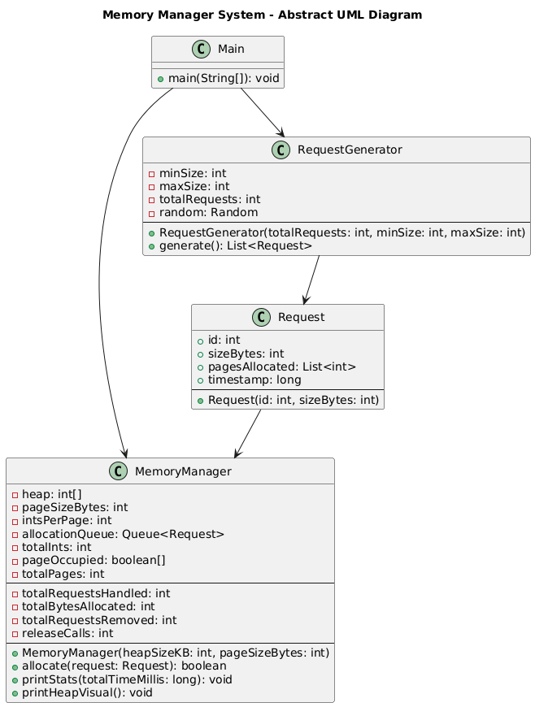

# Java Dynamic Memory Management Simulator

This project simulates a simplified **dynamic memory manager** in Java, using a paging-based memory allocation strategy. It allows you to generate random memory requests and allocate them into a simulated heap, managing memory usage, deallocation with a FIFO policy, and visualizing memory pages.

## 📦 Features

- Simulates dynamic memory allocation using **paging**
- Heap implemented as an array of integers (each int = 4 bytes)
- Random memory request generation (configurable size and count)
- FIFO-based memory release when space is insufficient
- Graphical text visualization of heap memory layout
- Execution statistics summary (requests handled, average size, release calls, etc.)

## 🛠️ Technologies

- Java (JDK 8+)
- CLI-based input/output
- ANSI escape codes for colored heap visualization

## 🧠 How It Works

1. **Heap Setup**: The user defines the size of the heap in KB.
2. **Request Generation**: The system generates a number of random memory allocation requests with sizes between configurable min and max byte values.
3. **Paging Allocation**: Memory is allocated using a fixed page size (e.g., 64 bytes), and requests are stored across available pages.
4. **Memory Release**: If not enough space is available, the system automatically releases at least 30% of the heap using FIFO (First-In-First-Out) order.
5. **Visualization**: The user can view a graphical representation of heap memory after allocation.

## 📄 Example Usage

### User Prompts

Enter heap size (in KB): 128

Number of memory allocation requests to generate: 100

Minimum variable size (in bytes) \[default = 16]: 32

Maximum variable size (in bytes) \[default = 1024]: 512

Would you like to visually display the heap? (y/n): y

### Heap Visualization Output

Each block represents a memory page:
- 🟩 **Green**: Free page
- 🔵 **Blue**: Fully occupied by one variable (shows part of the ID)
- 🟧 **Orange**: Mixed or inconsistent data (rare case)

## 📊 Sample Output

\--- Execution Statistics ---

Total requests handled: 95

Average variable size: 268.42 bytes

Number of variables removed: 20

Memory release calls: 3

Total execution time: 87 ms

## 📁 Project Structure

src/

├── Main.java              // Main program entry point

├── MemoryManager.java     // Handles memory allocation, paging, and releasing

├── Request.java           // Represents a memory request

├── RequestGenerator.java  // Generates random requests

## UML

## ✅ How to Run

1. Compile the project:
javac *.java

2. Run the program:
java Main

## 🧪 Future Extensions

* Simulate **multi-threaded allocation**
* Implement **GUI visualization** using JavaFX or Swing
